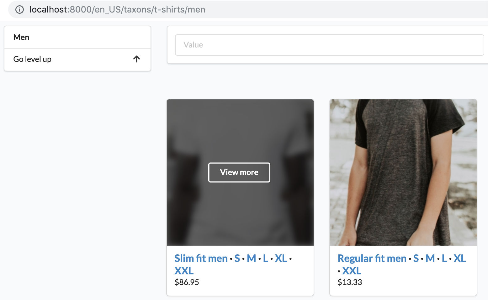
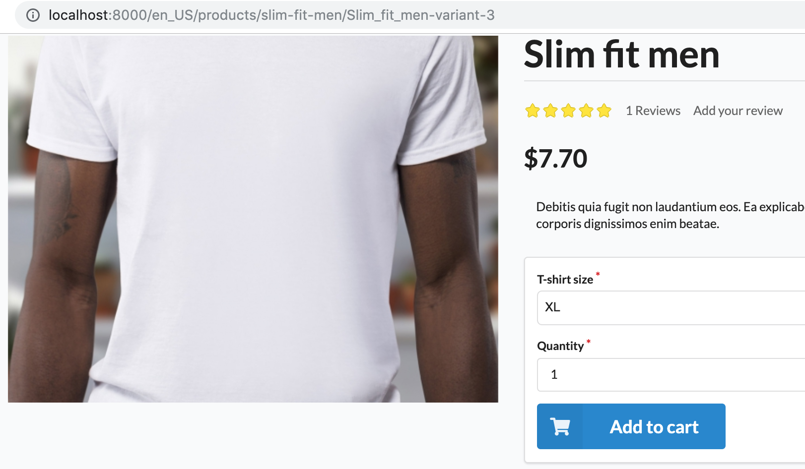

# Sylius Variant Link Plugin

[![Latest Version on Packagist][ico-version]][link-packagist]
[![Software License][ico-license]](LICENSE)
[![Build Status][ico-travis]][link-travis]
[![Quality Score][ico-code-quality]][link-code-quality]

In a standard Sylius shop it is not possible to link directly to variants. That problem is what this plugin solves.





## Installation

### Step 1: Download the plugin

Open a command console, enter your project directory and execute the following command to download the latest stable version of this bundle:

```bash
$ composer require setono/sylius-variant-link-plugin
```

This command requires you to have Composer installed globally, as explained in the [installation chapter](https://getcomposer.org/doc/00-intro.md) of the Composer documentation.


### Step 2: Enable the plugin

Then, enable the plugin by adding it to the list of registered plugins/bundles
in `config/bundles.php` file of your project:

```php
<?php

# config/bundles.php

return [
    // ...
    Setono\SyliusVariantLinkPlugin\SetonoSyliusVariantLinkPlugin::class => ['all' => true],
    // ...
];
```

### Step 3: Import routing

```yaml
# config/routes/setono_sylius_variant_link.yaml
setono_sylius_variant_link:
    resource: "@SetonoSyliusVariantLinkPlugin/Resources/config/routes.yaml"
```

## Usage

### Link to a variant

```twig
{# @var \Sylius\Component\Core\Model\ProductInterface product #}
{# @var \Sylius\Component\Core\Model\ProductVariantInterface variant #}

{{ path('setono_sylius_variant_link_shop_product_variant_show', {'slug': product.slug, 'variant_identifier': variant.code}) }}
```

See [example](tests/Application/templates/bundles/SyliusShopBundle/Product/_box.html.twig).

### View a product
If you have a product with slug `product-1` which has a variant with code `variant-code-1` the above twig statement will return
`/en_US/products/product-1/variant-code-1` on a default Sylius installation.

So try and go to that URL and you will see the respective variant is selected and the price is correct for the respective variant.

### Output variant values instead of product values
On the product show page (`/en_US/products/slug`) the product code is outputted, but let's say you want to output the variants
code instead. Then you just do it like this:

```twig
{{ (product|sylius_resolve_variant).code }}
```

If you want to do that multiple places you can of course set the product variant like so:

```twig


{{ variant.code }}
```

Easy peasy!

## Extending
### I want to use something else than variant code for the URL
Let's say you have a store with clothes and you want to use the size of clothes in the URL to determine the variant.
You want to end up with URLs like `/en_US/products/product-1/medium`.

All you need to do is to create a new `ProductVariantFromIdentifierResolver`:

```php
<?php
namespace App\Resolver;

use Setono\SyliusVariantLinkPlugin\Resolver\ProductVariantFromIdentifierResolverInterface;
use Sylius\Component\Core\Model\ProductInterface;
use Sylius\Component\Core\Model\ProductVariantInterface;

final class ProductVariantFromSizeResolver implements ProductVariantFromIdentifierResolverInterface
{
    public function resolve(ProductInterface $product, string $identifier) : ?ProductVariantInterface
    {
        foreach ($product->getVariants() as $variant) {
            foreach ($variant->getOptionValues() as $optionValue) {
                if(strtolower($optionValue->getValue()) === $identifier) {
                    return $variant;
                }
            }
        }
        
        return null;
    }
}
```

Now define the service:

```xml
<?xml version="1.0" encoding="UTF-8" ?>

<container xmlns:xsi="http://www.w3.org/2001/XMLSchema-instance" xmlns="http://symfony.com/schema/dic/services"
           xsi:schemaLocation="http://symfony.com/schema/dic/services http://symfony.com/schema/dic/services/services-1.0.xsd">
    <services>
        <service id="Setono\SyliusVariantLinkPlugin\Resolver\ProductVariantFromIdentifierResolverInterface"
                 alias="app.resolver.product_variant_from_size"/>

        <service id="app.resolver.product_variant_from_size" class="App\Resolver\ProductVariantFromSizeResolver"/>
    </services>
</container>
```

If you're using autowiring you only need the alias.

[ico-version]: https://img.shields.io/packagist/v/setono/sylius-variant-link-plugin.svg?style=flat-square
[ico-license]: https://img.shields.io/badge/license-MIT-brightgreen.svg?style=flat-square
[ico-travis]: https://travis-ci.com/Setono/SyliusVariantLinkPlugin.svg?branch=master
[ico-code-quality]: https://img.shields.io/scrutinizer/g/Setono/SyliusVariantLinkPlugin.svg?style=flat-square

[link-packagist]: https://packagist.org/packages/setono/sylius-variant-link-plugin
[link-travis]: https://travis-ci.com/Setono/SyliusVariantLinkPlugin
[link-code-quality]: https://scrutinizer-ci.com/g/Setono/SyliusVariantLinkPlugin
